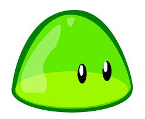
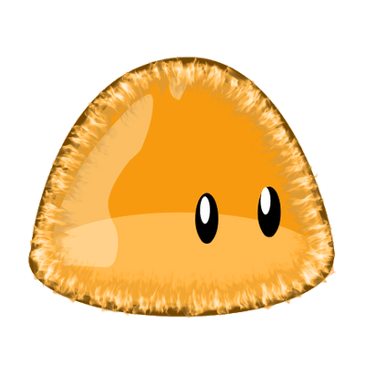
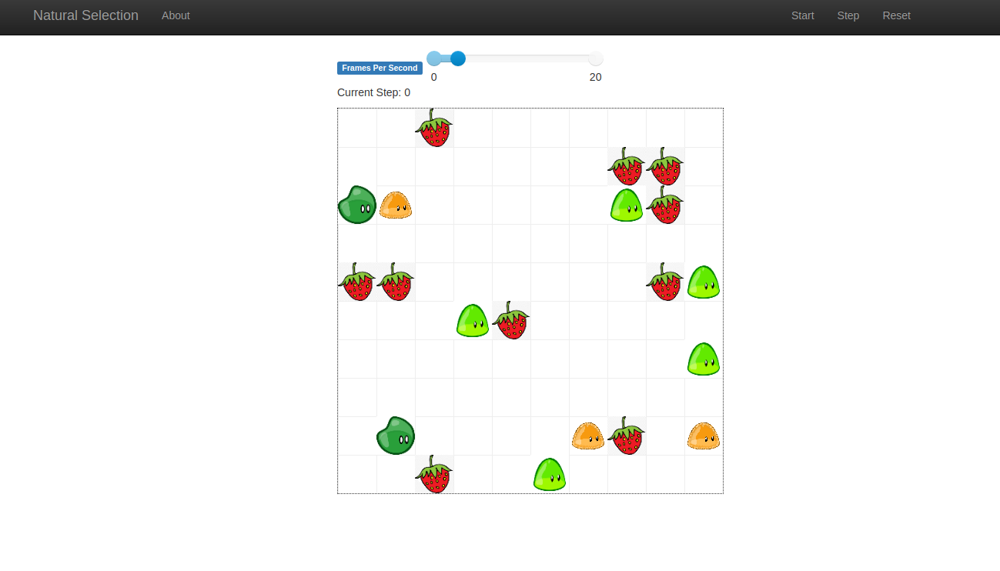
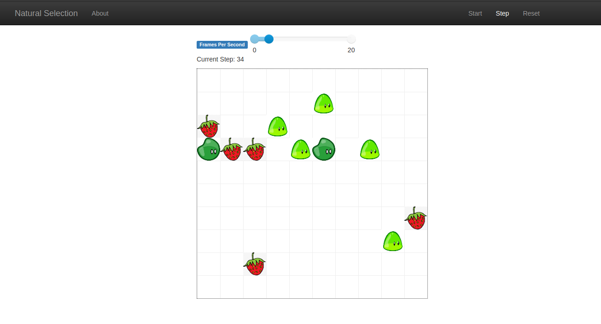

# Natural Selection

**Disciplina**: FGA0210 - PARADIGMAS DE PROGRAMAÇÃO - T01 <br>
**Nro do Grupo**: G5<br>
**Paradigma**: SMA<br>

## Alunos
|Matrícula|Aluno                                   |
|---------|----------------------------------------|
|18/0011961|Aline Helena Lermen                     |
|17/0006328|Ariel Vieira Lima Serafim               |
|19/0056843|Carlos Eduardo de Sousa Fiuza           |
|17/0139981|Danillo Gonçalves de Souza              |
|17/0010341|Gabriel Davi Silva Pereira              |
|18/0122606|Isadora da Cruz Galvão dos Santos Soares|
|17/0069800|Ithalo Luiz de Azevedo Mendes           |
|17/0145514|Iuri de Souza Severo Alves              |
|17/0164411|Victor Amaral Cerqueira                 |

## Sobre 
Esse projeto simula um sistema de selecão natural. Tivemos como base esse projeto [aqui](https://www.youtube.com/watch?v=0ZGbIKd0XrM&t=9s&ab_channel=Primer). O programa foi desenvolvido em python utilizando o framework MESA.
- O projeto consiste na luta de "species" para sobreviver, comer e se reproduzir enquanto competem com outros indivíduos de diferentes características. Os species e a comida são representados por agentes.
- Dentre os species temos:
- Raça "Normal" representado pela imagem:


- Raça "Rápida" representado pela imagem;


- Raça "Canibal" representado pela imagem;


- Representando a comida temos a imagem:


Nas próximas seções é explicado como executar o programa, além de apresentar um vídeo com explicações mais detalhadas sobre o projeto.

## Screenshots

- Execução do projeto





## Instalação

**Linguagens**: Python <br/>
**Tecnologias**: Mesa <br/>

- Instalar o python na sua máquina.
- Instalar o framework Mesa ([tutorial](https://mesa.readthedocs.io/en/main/tutorials/intro_tutorial.html#installation)).
- Realizar o clone deste repositório na pasta que desejar.
- Entrar na pasta "2021.2_G5-SMA_Natural_Selection".
- Executar o seguinte comando para lançar o server da aplicação:

```
python server.py
```

## Uso

Com o lançamento do server da aplicação irá abrir no navegador padrão do sistema uma página contendo o frontend do projeto, nele é possível identificar os seguintes elementos na navbar da página:

- Start: inicia a execução dos agentes
  - Caso já esteja executando irá aparecer a opção "Stop" para parar a execução.
- Step: Realiza um "tick" para cada agente.
- Reset: Reinicia a model e os agentes.

Ademais no body da página temos os seguintes elementos:

- Frames per second: permite escolher quantos steps são realizados por segundo.
- Grid ou tabuleiro: nele é possível ver a execução dos agentes dentro do "tabuleiro".


## Vídeo
[Apresentação](https://github.com/UnBParadigmas2021-2/2021.2_G5-SMA_Natural_Selection/blob/master/media/apresentacao.mp4)

## Fontes

- Usamos como inspiração para o tema o projeto [Simulando a Seleção Natural](https://www.youtube.com/watch?v=0ZGbIKd0XrM&t=9s&ab_channel=Primer).
- Como fonte de exemplo do uso das tecnologias o projeto [2021.1_G1_SMA_Universitarios](https://github.com/UnBParadigmas2021-1/2021.1_G1_SMA_Universitarios).
- Documentação do [Mesa](https://mesa.readthedocs.io/en/main/overview.html)
